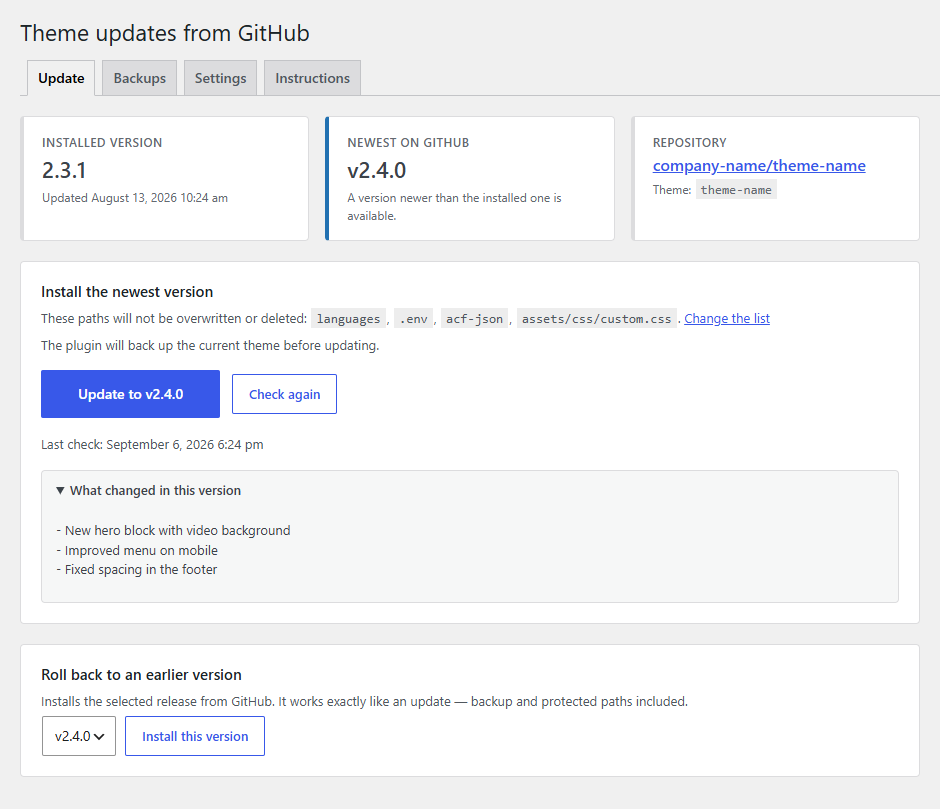
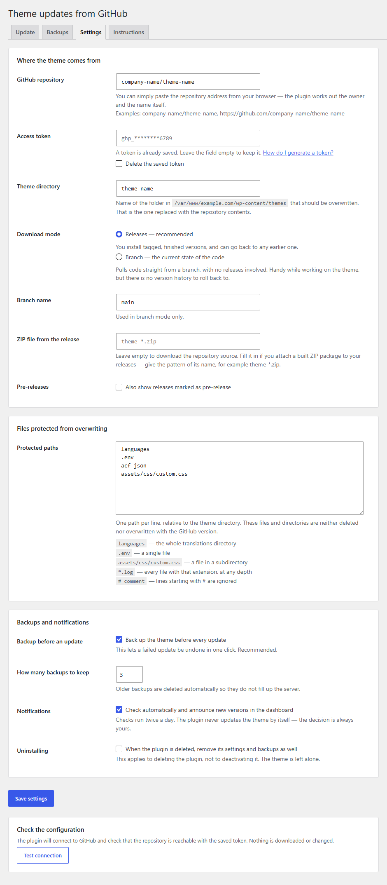
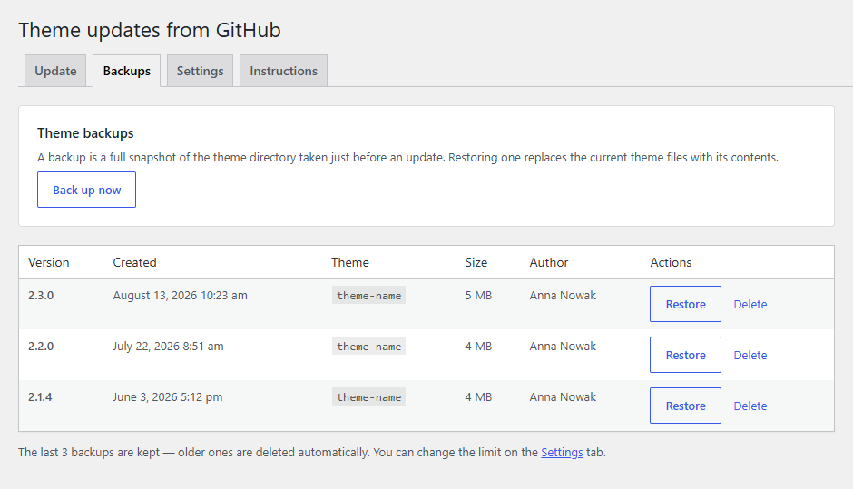

# GitHub Theme Updater

**English** · [Polski](README.pl.md)

Updates a WordPress theme straight from a GitHub repository — private ones included — with backups, version rollback, and per-path protection against overwriting.

- **Version:** 2.2.0
- **Author:** [ms-m.pl](https://ms-m.pl)
- **Requires:** WordPress 5.8+, PHP 7.4+
- **Text domain:** `github-theme-updater`

---

## Screenshots

| Update | Settings | Backups |
| --- | --- | --- |
|  |  |  |

---

## Structure

```
github-theme-updater.php      bootstrap: constants, autoloader, hook registration
uninstall.php                 cleanup after the plugin is deleted for good
includes/
  class-plugin.php            builds the object graph and registers hooks
  class-lifecycle.php         activation, deactivation, migration from 1.x
  class-settings.php          settings schema and validation (a single option)
  class-token-storage.php     encrypts the token before it reaches the database
  class-repository.php        value object: owner/repo plus URL builders
  class-release.php           value object: a release, or a branch snapshot
  class-github-client.php     all HTTP to GitHub, caching, error mapping
  class-path-rules.php        protected path matching
  class-filesystem.php        recursive file operations through WP_Filesystem
  class-backup-manager.php    creating, restoring and rotating backups
  class-theme-installer.php   update sequence plus automatic rollback
  class-update-checker.php    scheduled version checks and the admin notice
  class-auto-updater.php      unattended updates: the daily schedule and webhook-queued runs
  class-notifier.php          e-mail reports of automatic runs
  class-webhook.php           GitHub webhook endpoint: signature check, filtering, queueing
  class-notices.php           messages carried across a redirect
  class-admin-page.php        menu and tabs
  class-admin-actions.php     form handling (nonce, capability, redirect)
views/                        tab templates
assets/                       admin styles and script
languages/                    .pot file for translations
tests/                        PHPUnit suite (runs without WordPress)
.github/workflows/ci.yml      lint, PHPCS, PHPStan and tests on every push
composer.json                 dev dependencies and the check scripts
phpcs.xml.dist                WordPress Coding Standards ruleset
phpstan.neon.dist             static analysis configuration
phpunit.xml.dist              test suite configuration
```

The dividing line: `Github_Client` is the only class that speaks HTTP, `Filesystem` is the only one that touches the disk, and `Theme_Installer` only decides the order of the steps. The rest of the plugin sees nothing but `Release` objects and `WP_Error`s.

---

## Settings

Everything lives in a single `gthu_settings` option, which keeps a form submit atomic.

| Key | Default | Description |
| --- | --- | --- |
| `repository` | `''` | `owner/repo`; normalised from any GitHub URL on save |
| `token` | `''` | access token, encrypted with AES-256-CBC using a key derived from the WordPress salts |
| `theme_slug` | `''` | name of the theme directory to overwrite |
| `source` | `release` | `release` (published releases) or `branch` (current state of a branch) |
| `branch` | `main` | used in branch mode only |
| `asset_pattern` | `''` | glob for a ZIP attached to the release, e.g. `theme-*.zip`; empty means source code |
| `include_prereleases` | `false` | whether releases flagged as pre-release are offered |
| `protected_paths` | `languages`, `.env`, `acf-json` | paths an update must not touch |
| `ignored_paths` | `.git`, `node_modules` | paths never copied: not into backups, not from the archive, left alone on disk |
| `create_backup` | `true` | take a backup before every update |
| `backup_limit` | `3` | how many backups to keep |
| `check_updates` | `true` | scheduled checks and a dashboard notice |
| `delete_data` | `false` | whether to remove plugin data when the plugin is deleted |
| `auto_update` | `false` | install a newer release once a day without anyone clicking — see [Automatic updates](#automatic-updates) |
| `auto_update_time` | `03:00` | preferred hour of that run, in the site time zone |
| `notify_emails` | `''` | comma separated addresses that receive a report after every automatic run |
| `webhook_enabled` | `false` | update the moment a release is published, through a GitHub webhook |
| `webhook_secret` | `''` | shared secret of the webhook, generated by the plugin and encrypted like the token; `webhook_secret_at` records when |

Runtime state (`gthu_state`, `autoload = false`): `installed_version`, `installed_at`, `installed_by`, `last_check`, `latest_version`, `last_error`, plus the outcome of the last automatic run (`auto_last_run`, `auto_last_trigger`, `auto_last_status`, `auto_last_message`, `auto_notified_error`) and of the last webhook delivery (`webhook_last_at`, `webhook_last_status`, `webhook_last_message`).

Operation log (`gthu_history`, `autoload = false`): the last 5 updates and restores, failed ones included, each with the version, the previous version, the result, the number of copied files, the user and the duration. Shown at the bottom of the Update tab; the `gthu_history_limit` filter changes how many entries are kept.

### Protected paths

One rule per line, relative to the theme root:

| Rule | Meaning |
| --- | --- |
| `languages` | the whole directory and everything under it |
| `.env` | a single file |
| `assets/css/client.css` | a file in a subdirectory |
| `*.log` | wildcard match at any depth |
| `# text` | a comment, ignored |

`..` segments are stripped during normalisation, so a rule can never reach outside the theme directory.

### Ignored paths

Same syntax, different purpose. A protected path is something the site owner wants to keep, and it still goes into every backup. An ignored path is something the plugin should never look at: it is left out of backups, never installed from the archive, and never deleted or overwritten on disk. The defaults are `.git` and `node_modules` — development leftovers that are not part of a theme but can hold tens of thousands of files and turn a backup into a multi-minute job. Add `vendor` if it is git-ignored in your repository; do not add it if the theme needs a committed `vendor` at runtime, because it would then be missing after the first install.

---

## Token in wp-config.php

The recommended setup for production — the token never reaches the database and cannot be read back from the admin:

```php
define( 'GTHU_GITHUB_TOKEN', 'ghp_...' );
```

The constant takes precedence over whatever is stored in the settings.

---

## What an update does

1. Downloads the ZIP archive of the selected release.
2. Unpacks it into a working directory under `wp-content/upgrade/`.
3. Locates the theme inside the archive by looking for `style.css` (GitHub names source archives `owner-repo-sha`, so the directory name is unpredictable).
4. Checks that everything it is about to delete can be deleted: every directory has to be writable by the PHP user, and on Windows read-only files are made writable on the spot. An undeletable path stops the update here, before anything changes.
5. Takes a backup of the current theme.
6. Empties the theme directory, skipping protected and ignored paths.
7. Copies the new files in, again skipping protected and ignored paths.
8. Cleans up temporary files and records the new state.

Nothing in the theme directory is touched before step 6, so a failed download, a corrupt archive or a permissions problem cannot break a working site. If step 6 or 7 fails, the theme is restored automatically from the backup taken in step 5, and the result message says whether that restore worked.

Only one update may run at a time: it holds the `gthu_install_lock` option row, claimed with a single `INSERT IGNORE` so that two requests cannot both win. Rollbacks and manual backups take the same lock. Before anything is deleted the installer also compares the `Theme Name` and `Text Domain` headers of the archive's `style.css` with the theme on disk, and refuses to replace one theme with another (the `gthu_theme_identity_matches` filter can override that).

### Watching it run

While an update runs, the Update tab lists every step above, marks the one in progress, shows a running file count for the backup and copy steps, and counts the elapsed time. The installer records its current step in the `gthu_install_progress` transient; the admin script sends the form with `fetch()` and polls the `gthu_progress` AJAX endpoint once a second until the request completes, then follows the redirect so the result notice appears as usual. Opening the Update tab while an update started elsewhere is still running picks the progress up and reloads the page when it finishes.

Without JavaScript the form submits normally and the result appears after the redirect, as before.

---

## Automatic updates

Off by default. Both options live in the "Automatic updates" panel on the Settings tab, work in **Releases mode only** (a branch has no version number to compare) and run the exact sequence of the Update button — lock, backup, verification, copy, rollback on failure, operation log — followed by an e-mail report. The **Run now** button under the settings performs one such run immediately, e-mails included, so the chain can be tested while someone is watching.

### Scheduled run

`auto_update` schedules the `gthu_auto_update` WP-Cron event daily at `auto_update_time` (site time zone). The run fetches the release list with the cache bypassed, compares the newest release with `installed_version`, and installs it only if it is newer. Nothing newer means nothing happens and no e-mail. A run that finds the install lock taken (an update or restore in progress) is skipped until the next day. The schedule is re-synchronised whenever the settings are saved, after each run (DST drift) and by the twice-daily check as a safety net.

**The hour is a "not before", not a guarantee.** WordPress has no clock of its own; WP-Cron only wakes up when a request runs PHP. The run is late when:

- nobody visits the site at night — the task waits for the first request after the scheduled time;
- a page cache or CDN serves visitors without touching PHP;
- `DISABLE_WP_CRON` is set and the hosting's system cron ticks less often;
- another operation holds the lock at that moment;
- the site time zone or daylight saving changed (corrected on the next run or settings save);
- the server is busy or a previous cron worker is still running — core runs one at a time.

For an exact hour, add `define( 'DISABLE_WP_CRON', true );` to `wp-config.php` and have a system cron call `wp-cron.php` every few minutes:

```
*/5 * * * * curl -s https://example.com/wp-cron.php?doing_wp_cron > /dev/null 2>&1
```

### E-mail reports

`notify_emails` takes one or more addresses (commas, semicolons or whitespace separate them; invalid entries are reported on save). Every automatic run that installs something, or fails trying, sends a plain text message with the previous and the new version, the trigger, the backup name, the number of files, the protected paths, a link to the plugin screen and the release notes written on GitHub. A failed GitHub check (expired token, renamed repository) is reported once per distinct error. Updates started by hand from the Update tab are not e-mailed. **Send a test e-mail** confirms the addresses and the site's mail setup.

### GitHub webhook

`webhook_enabled` makes the update happen the moment a release is published. Setup:

1. Tick the option and save. The plugin generates a 64-character secret, stores it encrypted (like the token) and shows it **once**; the payload URL appears under the checkbox. A `GTHU_WEBHOOK_SECRET` constant in `wp-config.php` can replace the stored secret.
2. On GitHub: repository → Settings → Webhooks → Add webhook. Payload URL `https://example.com/wp-json/gthu/v1/release`, content type `application/json`, the secret from step 1, SSL verification on, events: "Let me select individual events" → **Releases** only, Active.
3. GitHub sends a ping; "Recent Deliveries" should show 200 and the Settings tab "GitHub sent a ping".

The site must be reachable from the internet (a local development site needs a tunnel). On a delivery the plugin queues a `gthu_webhook_update` single event and pokes the cron runner, so the update runs within a minute or two; when GitHub's API has not caught up with the event yet, the run is retried after 3 and 6 minutes.

How the endpoint is protected:

- The route is not registered at all while the feature is off or no secret exists — it answers 404 like any unknown URL.
- Bodies over 256 KB are refused before being read.
- Every request must carry `X-Hub-Signature-256`, an HMAC-SHA256 of the raw body under the secret, compared with `hash_equals()` in the permission callback. Unsigned requests get 401, wrongly signed ones 403; both only leave a note on the Settings tab.
- Only `release` events with the `published` action count. `ping` answers with a pong; other events and actions return 202 and do nothing.
- The `repository.full_name` in the payload must match the configured repository (403 otherwise). Drafts and, unless `include_prereleases` is on, pre-releases are ignored.
- `X-GitHub-Delivery` identifiers are remembered for a week, so a redelivered or replayed request is a no-op.
- **The payload never decides what is installed.** A verified delivery only queues a normal automatic run, which asks GitHub's API for the newest release with the site's own token and installs it only if it is newer than the installed version — after the same identity check, backup and rollback as any other update, under the same lock.

---

## Extension points

### Actions

| Hook | Arguments | Fires |
| --- | --- | --- |
| `gthu_before_install` | `Release $release` | before the archive is downloaded |
| `gthu_after_install` | `Release $release, array $summary` | after a successful update |
| `gthu_install_failed` | `WP_Error $error` | after a failed attempt |
| `gthu_auto_update_finished` | `string $status, string $trigger, string $message, ?Release $release` | after every automatic run, whatever the outcome (`updated`, `failed`, `up_to_date`, `locked`, `check_failed`, `branch_mode`, `not_configured`) |

### Filters

| Hook | Default | Purpose |
| --- | --- | --- |
| `gthu_capability` | `manage_options`, or `manage_network_themes` on multisite | capability required to operate the plugin |
| `gthu_backup_dir` | `wp-content/gthu-backups` | backup directory |
| `gthu_cache_lifetime` | `900` | release list cache lifetime (seconds) |
| `gthu_download_timeout` | `300` | archive download timeout (seconds) |
| `gthu_history_limit` | `5` | number of operations kept in the log on the Update tab |
| `gthu_notification_recipients` | addresses from the settings | who receives a report; second argument is the event (`installed`, `failed`, `check_failed`, `test`) |
| `gthu_notification_message` | `['to', 'subject', 'body', 'headers']` | the report before `wp_mail()`; return an array without `to` to suppress it |

Example — flushing the object cache after every update:

```php
add_action( 'gthu_after_install', function ( $release, $summary ) {
    wp_cache_flush();
}, 10, 2 );
```

---

## FAQ — what can go wrong

### Can a failed update take down a live site?

The theme directory is not touched at all until the backup has been taken. A download error, a bad token, a corrupt archive, a missing `style.css` — each of these ends with a message and zero changes on disk. If the update fails later, while copying files, the theme is restored automatically from the backup made moments earlier.

There is exactly one real window of risk: between emptying the theme directory and copying the new files in. On a large theme that takes a few seconds, and visitors may see an error during it. Run updates outside peak hours.

### What if I close the tab mid-update?

The installer sets `ignore_user_abort( true )`, so PHP finishes the job even after the browser disconnects. You will not see the result message — but if you come back to the Update tab while the update is still running, it shows the current step and reloads itself when the update finishes.

If the process is killed outright (a PHP-FPM restart, the server's `max_execution_time`), the theme directory can be left in a partial state. In that case: **Backups → Restore** the top entry.

### What happens if two people click "Update" at the same time?

The second one gets a message saying an operation is already running. Updates, rollbacks and manual backups share one lock (the `gthu_install_lock` option, honoured for 15 minutes), claimed atomically, so they cannot run in parallel or interleave even when both clicks land in the same second.

If a process was killed and left the lock behind, the Update tab shows how long it has been held and offers a **Release lock** button, so nobody has to wait the 15 minutes out.

### I changed the salts in wp-config.php and the plugin stopped connecting

The token is encrypted with a key derived from `wp_salt( 'auth' )`. Changing the salts — or moving the database to an installation with a different `wp-config.php` — makes the stored token undecryptable, and it has to be pasted in again under Settings. If you move sites between environments, keeping the token in the `GTHU_GITHUB_TOKEN` constant is less trouble.

### Files that are not in the repository disappear after an update

Yes, and that is deliberate: after an update the theme directory is meant to match the repository. This covers both files deleted from the repo and files uploaded to the server by hand. Anything that has to survive belongs on the **protected paths** list before the update runs.

The most common case: `vendor/` or `node_modules/` is in `.gitignore`, so it is missing from the GitHub archive — and the theme stops working after an update. Two ways out: add the directory to the protected paths, or attach a built ZIP to the release and set `asset_pattern`.

### I installed a broken version and the site went down

Two ways back, both in the admin:

1. **Backups → Restore** — brings back exactly what was there before the update.
2. **Update → Roll back to an earlier version** — installs an older release from GitHub.

If the admin is unreachable, the backups sit in `wp-content/gthu-backups/` and can be copied over via FTP.

### Will the plugin update the theme on its own?

Only if you ask it to. By default it checks for versions twice a day and shows a notice, and a human starts the installation. The "Automatic updates" panel on the Settings tab adds two opt-in ways to skip the click: a nightly run at a chosen hour, and a GitHub webhook that updates the moment a release is published. Both follow the same sequence as the button — backup, verification, rollback, log — and e-mail a report. See [Automatic updates](#automatic-updates).

### I set the update to 3:00 and it ran at 6:40. Why?

Because WordPress has no clock of its own. WP-Cron, its scheduler, only wakes up when a request runs PHP on the site — a page view, an admin screen, a REST call. The hour you pick is therefore a "not before": the run starts with the first such request after it. The usual reasons for a late run:

- **No visitors at night.** On a quiet site the task waits for the first visitor of the morning.
- **A page cache or a CDN.** Cached pages are served without PHP, so even a busy site can look empty to the scheduler.
- **`DISABLE_WP_CRON` and a system cron.** The run happens on that cron's next tick — every 5 minutes, every hour, whatever the hosting configured.
- **The lock is taken.** An update, restore or backup started by hand at that moment makes the run skip to the next day.
- **Time zone or DST changed.** The schedule is corrected on the next run and on the next settings save, so one run can land an hour off.
- **A busy server.** WordPress runs one cron worker at a time and skips a tick it cannot start.

For an hour you can count on, add `define( 'DISABLE_WP_CRON', true );` to `wp-config.php` and have a system cron call `wp-cron.php` every few minutes — see [Scheduled run](#scheduled-run). The **Run now** button under the settings does not depend on any of this.

### Is an unattended update at night safe?

As safe as a click during the day: it is the same code path. The plugin downloads the release, checks that the archive is a theme and the same theme as the one on disk, checks that every file it will delete can be deleted, takes a backup, and only then replaces files. A failure during the copy restores the backup automatically. What it cannot know is whether the *new version* of your theme is any good — that is what a staging site is for. Keep `create_backup` on and read the e-mail in the morning.

### Nothing happened at night. Was the update skipped?

Most likely there was nothing to do: the run only installs when GitHub has a release **newer** than `installed_version`, and a run with nothing to install sends no e-mail. The "Last automatic run" line on the Settings tab shows when it ran and what it decided ("Nothing to do: installed v1.4.0, newest on GitHub v1.4.0"). If that line is old, WP-Cron did not wake up — see the previous question. If it says the lock was taken, someone was updating or restoring at that moment.

### Which e-mails will I get?

Only about automatic runs (schedule or webhook), and only when something happened: a successful update, a failed attempt, or a failed GitHub check (an expired token, a renamed repository — reported once per distinct error, not every night). Updates started by hand from the Update tab are not e-mailed. The report holds the previous and the new version, the trigger, the backup name, the number of files, the protected paths and the release notes written on GitHub. If nothing arrives, click **Send a test e-mail**: WordPress alone often ends up in spam, and an SMTP plugin fixes that.

### Is it safe to expose the webhook address?

Yes. While the option is off the address does not exist (404). While it is on, every request must carry GitHub's HMAC-SHA256 signature under a secret only you and GitHub know; anything unsigned or wrongly signed is refused before it is read further. Only "release published" events for the configured repository are accepted, repeated deliveries are ignored, and — the important part — the request never decides what gets installed. It only queues the same run the schedule uses, which asks GitHub's API with your own token and installs the newest release if it is newer. Details under [GitHub webhook](#github-webhook).

### The webhook shows a red cross on GitHub

Open "Recent Deliveries" on GitHub and look at the response code. 404: the option is off on the site, or the address was mistyped. 401: the request carried no signature — the "Secret" field on GitHub is empty. 403: the secret differs, or the webhook sits on a different repository than the one entered under Settings; the Settings tab shows which. A timeout usually means the site is not reachable from the internet — a local development site needs a tunnel.

### Can I auto-update from a branch?

No. A branch has no version number, so the plugin cannot tell whether the current state of the code is newer than what is installed. Both automatic options are saved but do nothing in Branch mode; the Settings tab says so. Publish releases instead — see step 3 on the Instructions tab.

### Will I lose theme settings, content or widgets?

No — an update only affects files in the theme directory. The database, theme options, Customizer, menus and content are untouched.

### Do I need a token for a public repository?

No. A token is only required for private repositories. It is still worth adding one: without it GitHub limits traffic to 60 requests per hour per IP address, which on shared hosting tends to end in a 403.

### The repository holds several themes, or all of wp-content

The plugin looks for `style.css` and, with several themes present, will take the first one it finds — which need not be the right one. Recommended: one repository per theme. Alternative: attach a ready ZIP holding only the theme to the release and point at it with `asset_pattern`.

### Are backups reachable from the web?

The directory gets an `index.php`, an `.htaccess` and a `web.config` that deny access. Those cover Apache and IIS — on nginx you have to add the rule yourself, or move backups outside the public directory with the `gthu_backup_dir` filter. Backups take space: theme size times the number of versions kept.

They deliberately do **not** live under `wp-content/upgrade/`: WordPress empties that directory before every core, plugin and theme update, which would delete them.

### Could wordpress.org overwrite my theme or this plugin?

Only if a theme or plugin in the wordpress.org directory shares the slug — then core would happily offer an "update" that replaces your code with a stranger's. The plugin declares `Update URI: false`, which tells WordPress never to look it up in the directory, and it filters `site_transient_update_themes` so the managed theme slug is dropped from directory responses. For belt and braces, add `Update URI: https://your-domain.example/` to the theme's `style.css` as well.

### Does it work on multisite?

It runs, but treat it as untested territory. Because the themes directory is shared across the network, the plugin requires the `manage_network_themes` capability there — a single site administrator cannot replace a theme other sites are running. Settings are still per-site, so two sites pointing at the same theme directory would overwrite each other; the Update tab warns about this.

### Can I use it with a child theme?

Yes — the plugin manages one directory, the one named in the "Theme directory" field. That can be a parent or a child theme. Managing both at once would need a second instance of the plugin.

---

## Development

```bash
composer install     # dev dependencies
composer test        # PHPUnit
composer phpcs       # WordPress Coding Standards
composer phpstan     # static analysis, level 6
composer phpcbf      # fix what phpcs can fix
composer check       # lint + phpcs + phpstan + test
```

Every push and pull request runs the same four checks on GitHub Actions
([`.github/workflows/ci.yml`](.github/workflows/ci.yml)): syntax linting and the
test suite on PHP 7.4 through 8.3, plus PHPCS and PHPStan on 8.3.

The suite covers the classes that carry the risky logic and have no WordPress
dependencies: repository parsing, protected path matching, release/version
comparison, token encryption and theme directory validation. `tests/bootstrap.php`
stubs the handful of WordPress helpers they call, so no WordPress installation is
needed to run them.

The plugin passes `phpcs` against the WordPress ruleset with no errors and no
warnings, and PHPStan level 6 with no errors. The few `phpcs:ignore` comments in
the codebase each carry a reason.

> PHPStan cannot index a project whose path contains non-ASCII characters. If you
> keep the plugin somewhere like `.moduły/`, run the analysis from a checkout in
> an ASCII-only path, or just let CI do it.

---

## Changelog

See [CHANGELOG.md](CHANGELOG.md).
---

## Troubleshooting

The site-owner version of this lives in the admin: **Theme from GitHub → Instructions → "When something goes wrong"**. Below is what helps when diagnosing from the code side.

### Messages from GitHub

| Message | Cause | What to do |
| --- | --- | --- |
| `401` — token rejected | token expired or was pasted incompletely | generate a new one; on fine-grained tokens check the expiry date |
| `403` — no access to the repository | the token does not cover this repository | fine-grained: repository on the "Only select repositories" list plus `Contents: Read-only`; classic: the `repo` scope |
| `403` — rate limit exceeded | request quota used up | wait; the `x-ratelimit-remaining` header is inspected and told apart from a permissions problem |
| `404` — repository not found | a typo, or a private repo with no token | check `owner/repo` and whether the token was saved |
| no releases in the repository | none published yet | create a release, or switch `source` to `branch` |

### File problems

**`WordPress has no direct file access (method: ftpext)`**
The plugin deliberately supports the `direct` transport only — an update has no way to ask for FTP credentials halfway through deleting a theme. Fix:

```php
define( 'FS_METHOD', 'direct' );
```

If that does not help, the problem is permissions on `wp-content/themes` (the directory owner has to match the user PHP runs as).

**`style.css not found in the downloaded archive`**
`style.css` has to sit in the repository root or at most three levels below it (`Filesystem::locate_theme_root()`). If the repository holds all of `wp-content`, point at a repository with just the theme, or attach a built package to the release and set `asset_pattern`.

**`vendor cannot be deleted by the web server user` / `Could not delete …`**
The pre-flight check (step 4 above) found a path the PHP user cannot remove, and stopped before touching anything. On Linux this almost always means the files are owned by another user — typically uploaded over SFTP as a different account than PHP-FPM runs as; `chown` them to the PHP user, or make the directories group-writable. On Windows the usual culprit is the read-only attribute, which git sets on pack files inside `.git` directories (including nested ones in `vendor` packages installed from VCS); the plugin clears it itself, so this message means something else holds the file, such as an editor or an indexer. A path that is not part of the theme belongs on the ignored paths list anyway.

**The update stops halfway**
`Theme_Installer::run()` sets `set_time_limit( 600 )` and `ignore_user_abort( true )`, but it cannot beat hard server limits. On large themes check `max_execution_time` and proxy limits (`proxy_read_timeout` in nginx). The download timeout itself is governed by the `gthu_download_timeout` filter.

### State and caching

- The release list is cached in the `gthu_releases_cache` transient (15 minutes by default). The **Check again** button clears it and refetches; the cache also clears itself when the repository or token changes.
- The last error is stored in `gthu_state.last_error` and shown at the bottom of the Update tab.
- Update notices rely on WP-Cron (`gthu_check_for_updates`, twice daily), and so does the scheduled automatic update (`gthu_auto_update`, daily at the chosen hour) and the webhook-queued run (`gthu_webhook_update`, single events). With `DISABLE_WP_CRON` you need a system cron, otherwise `latest_version` never refreshes on its own and the nightly run waits for a visitor — manual checks and the **Run now** button work regardless.

```bash
wp cron event list | grep gthu          # are the events scheduled, and for when
wp cron event run gthu_check_for_updates
wp cron event run gthu_auto_update      # the nightly run, right now
wp option get gthu_state --format=json  # versions, last check, last error, last automatic run, last webhook delivery
wp option get gthu_history --format=json  # recent updates and restores
wp transient delete gthu_releases_cache
```

### Changes vanished after an update

An update replaces the theme directory with the repository version. Anything that has to survive must be on the protected paths list **before** the update. If it is already gone, the **Backups** tab holds a snapshot from just before the update — assuming `create_backup` was on.

---

## Migrating from version 1.0

On first run the plugin rewrites the old options (`gthu_github_repo`, `gthu_github_token`, `gthu_theme_slug`, `gthu_last_installed_version`) into the new schema. The old options are left in place so a downgrade still finds its configuration.

Behavioural changes:

- The repository field takes plain `owner/repo`; a full API URL still works and gets normalised.
- The theme inside the archive is found by `style.css` rather than by a directory named after the slug. Version 1.0 looked for a directory matching the slug, which GitHub archives never contain.
- Protecting `/languages` is no longer hardcoded — it is one entry on a configurable list.
- The version recorded after an update is the release tag, not the archive file name.
- Forms require a nonce and a capability check; in 1.0 any logged-in user who reached the admin URL could trigger an update.
- Files are written through `WP_Filesystem` instead of direct `unlink()`/`copy()` calls.

---

## Translations

The source language is English. Every string goes through the i18n functions with
the `github-theme-updater` text domain, and the plugin ships with a Polish
translation:

```
languages/
  github-theme-updater.pot   template, 236 strings with translator comments
  pl_PL.po                   Polish translation
  pl_PL.mo                   compiled, this is the file WordPress loads
```

A site running in Polish picks `pl_PL` up automatically. To add another language,
copy the `.pot`, translate it and compile it:

```bash
cp languages/github-theme-updater.pot languages/de_DE.po
# translate de_DE.po, then:
wp i18n make-mo languages/
```

After changing strings in the code, refresh the template:

```bash
wp i18n make-pot . languages/github-theme-updater.pot --domain=github-theme-updater
```

On WordPress 6.5 and newer, `wp i18n make-php languages/` additionally produces
`.l10n.php` files, which load faster than `.mo`.
